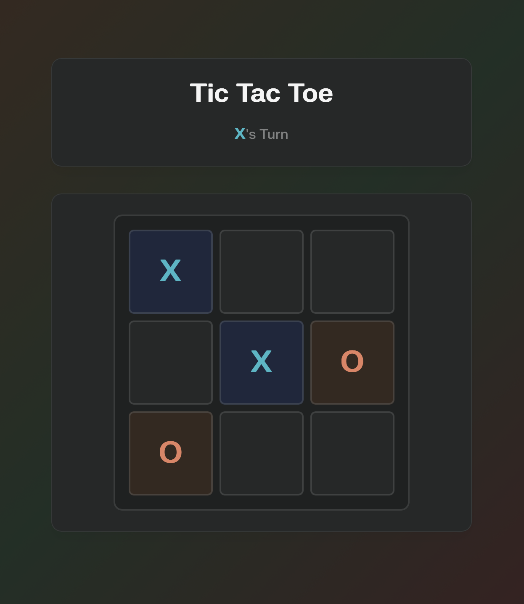

# 🎮 Tic Tac Toe — Liquid Glass

*Just a harmless timepass made entirely by AI — no humans were allowed near the keyboard.*

## ✨ Features

A minimalist, iOS-style liquid glass tic-tac-toe with **zero human coding involved**.

- 🌟 **Glassmorphism UI** with smooth hover and click feedback
- 🎯 **X always starts** — strict alternation with win/draw detection  
- 📱 **iOS-ish modal** popup with "Play Again" button
- 🐳 **Containerized** — runs anywhere Docker exists
- ⚡ **One-line install** — like Pi-hole, OMV, and other self-hosted apps

## 📸 Screenshots

*The liquid glass aesthetic in action*

## 🚀 One-Line Install

Perfect for **LXC containers in Proxmox**, VPS, or any Linux system:

### Quick Install (Port 8080)
